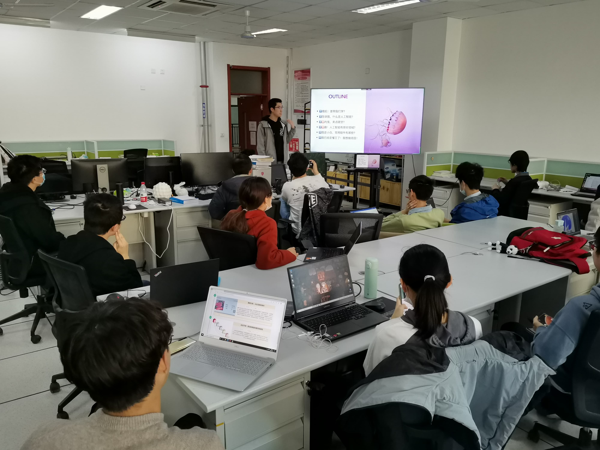
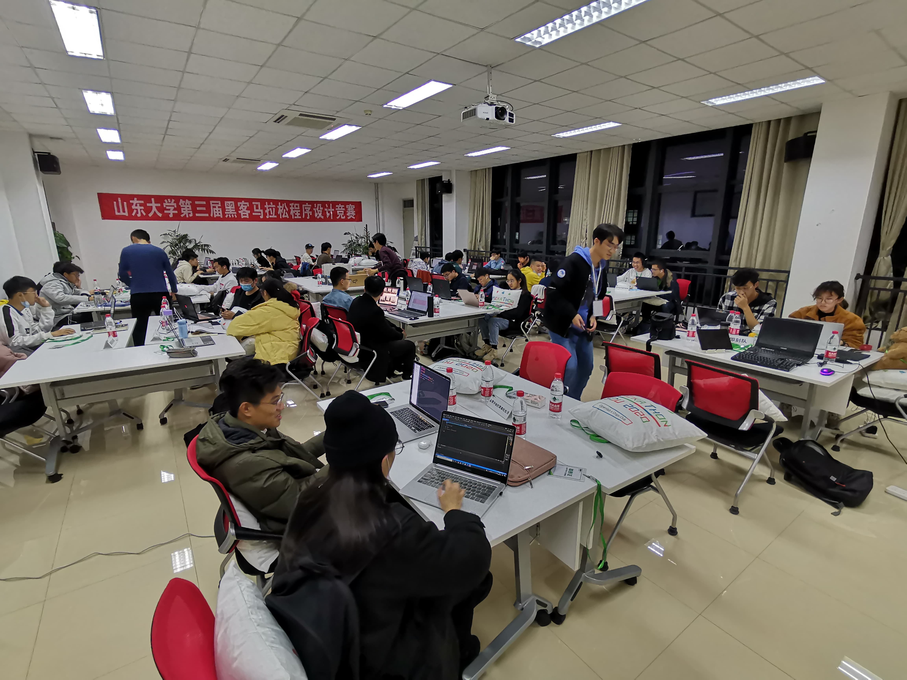
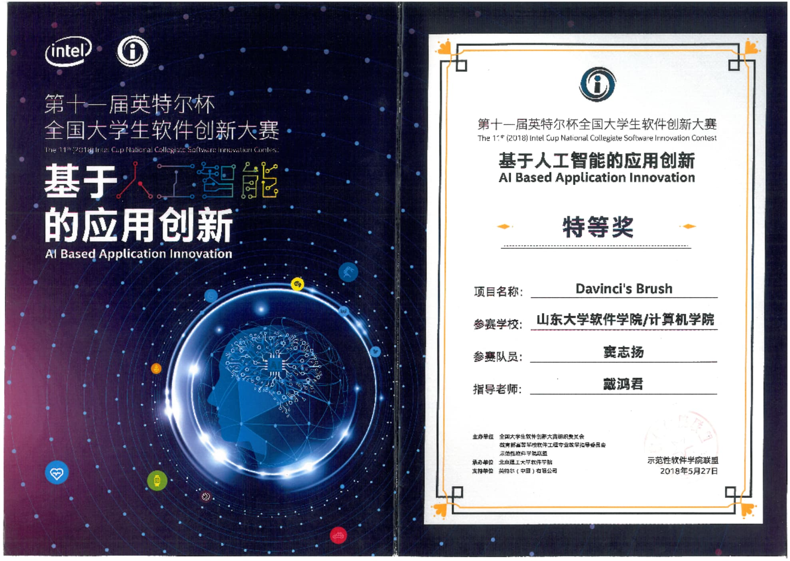

# 兴趣开放实验室

## 平台介绍

兴趣开放实验室创建于2015年，是隶属于计算机学院、面向整个山东大学的本科生实验室。致力于激发学生创新思维、培养工程项目开发人才，鼓励成员们把自己心中的有趣想法实现出来，同时也服务于创新项目竞赛的组织开展和培训指导。经过六年的发展与沉淀，兴趣开放已经成为一个成熟而有活力的平台，将热爱与进步传递到学院乃至整个校园。

## 组织活动

-  实验室内部课程，由优秀的学长学姐们精心组织，帮助你领先一步入门，也帮助你更加深入探索；以及兴趣引导课，由腾讯、字节跳动等公司的技术骨干和知名校友们亲临指导；

  

- 每年11月举办的“山东大学黑客马拉松”挑战赛，在短短36小时内完成一个项目的构思、开发和展示；这是展现技术实力和团队配合的时刻！更有丰厚的大奖向你招手！

  

- 全国大学生软件创新大赛、齐鲁软件大赛、华为、腾讯等公司组织的挑战赛等赛事的培训，由上一届比赛获奖的同学们传授独家秘笈，在比赛中助你一臂之力！

  

- 承接计算机科学与技术学院组织的创新实践项目评审，由专家教授进行项目评比，获得丰厚的奖金和学院级荣誉！

## 加入我们

- 提升自己的技术实力，多多涉猎专业的各个领域，找到自己的兴趣所在

- 将于10至11月左右开展兴趣开放实验室纳新，具体请关注交流群通知（下附交流群二维码）

  