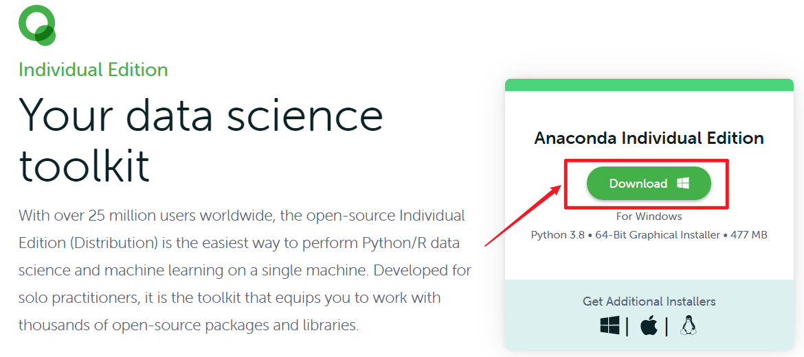
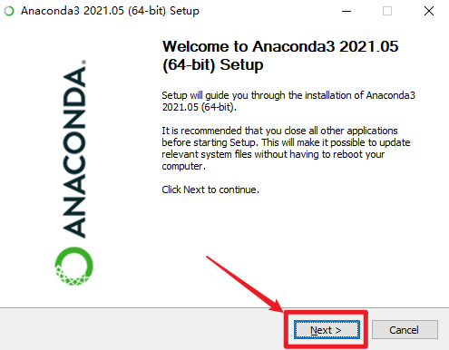
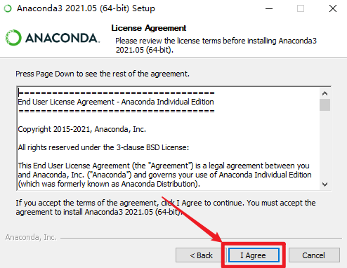
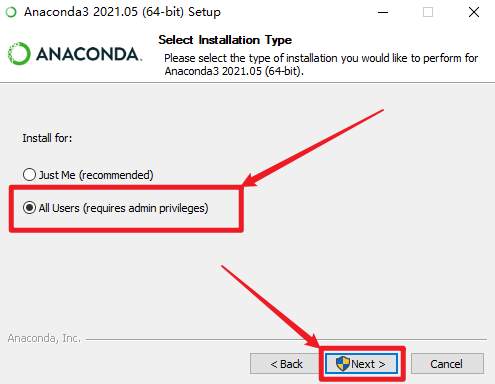
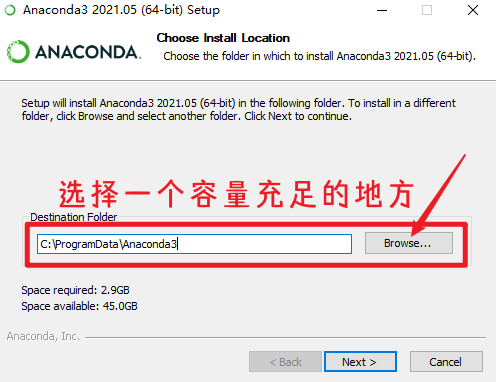

# Anaconda的安装与使用

## 1. 安装

### 1.1 下载

- 前往 [Anaconda ](https://www.anaconda.com/products/individual)官网下载 `Anaconda Individual Edition` (`Anaconda`个人版)

  

### 1.2 安装

- 找到下载好的 `Anaconda3-2021.05-Windows-x86_64.exe`，启动该文件

- 按照以下步骤进行安装

  

  

  

  

- 关键安装步骤已经完成，剩下步骤可一路`Next`/`Finish`

### 1.3 常用配置

